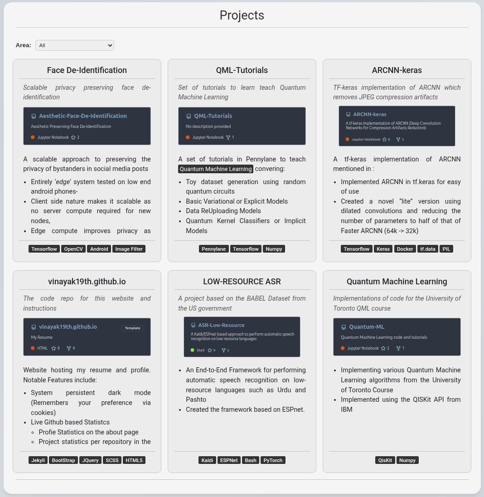
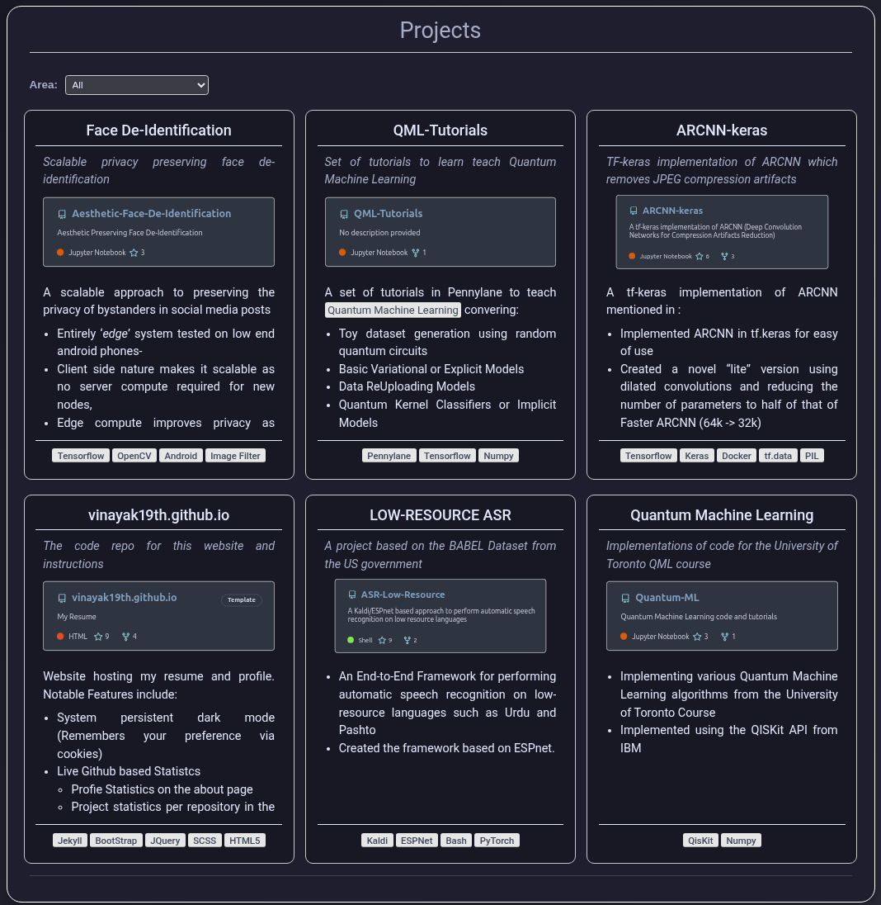
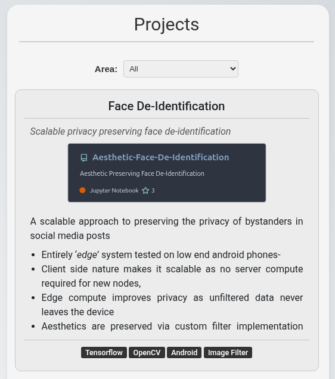
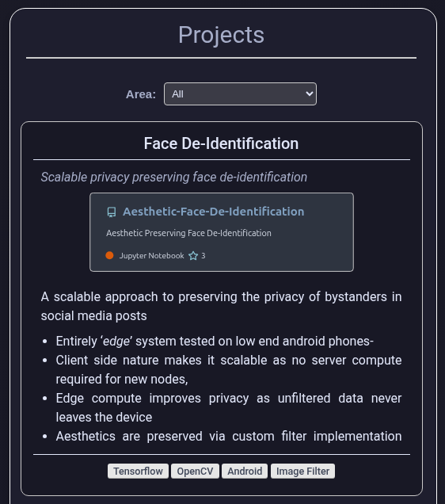

# Key Features

## Desktop Layouts
A preview of how the key features appear on desktop or large screen devices

<table border=2>
    <tr>
        <td>
Feature
</td>
        <td>
Light Mode
</td>
        <td>
Dark Mode
</td>
    </tr>
    <tr>
        <td>
Terminal Into
</td>
    	<td>
    		

    	</td>
    	<td>
    		

    	</td>
    </tr>
    <tr>
        <td>
Header
</td>
    	<td>
    		

    	</td>
    	<td>
    		

    	</td>
    </tr>
    <tr>
        <td>
Git Profile Stats
</td>
    	<td>
    		

    	</td>
    	<td>
    		

    	</td>
    </tr>
    <tr>
        <td>
Git Project Stats
</td>
    	<td>
    		

    	</td>
    	<td>
    		

    	</td>
    </tr>
    <tr>
        <td>
Tabbed Certification
</td>
    	<td>
    		

    	</td>
    	<td>
    		

    	</td>
    </tr>
</table>

## Mobile Layouts
A preview of how the key features appear on Mobile or Small screen devices

<table border=2>
    <tr>
        <td>
Feature
</td>
        <td>
Light Mode
</td>
        <td>
Dark Mode
</td>
    </tr>
    <tr>
        <td>
Terminal Into
</td>
    	<td>
    		

    	</td>
    	<td>
    		

    	</td>
    </tr>
    <tr>
        <td>
Header
</td>
    	<td>
    		

    	</td>
    	<td>
    		

    	</td>
    </tr>
    <tr>
        <td>
Git Profile Stats
</td>
    	<td>
    		

    	</td>
    	<td>
    		

    	</td>
    </tr>
    <tr>
        <td>
Git Project Stats
</td>
    	<td>
    		

    	</td>
    	<td>
    		

    	</td>
    </tr>
    <tr>
        <td>
Tabbed Certification
</td>
    	<td>
    		

    	</td>
    	<td>
    		

    	</td>
    </tr>
</table>

